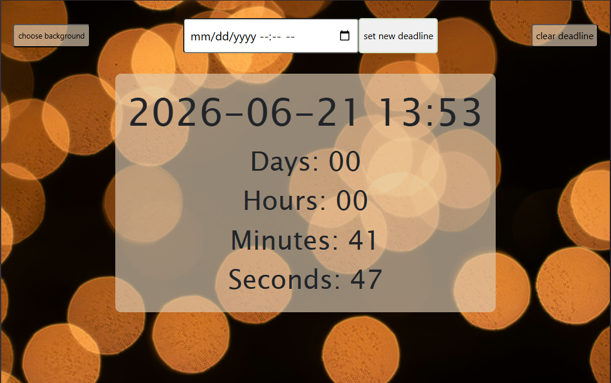
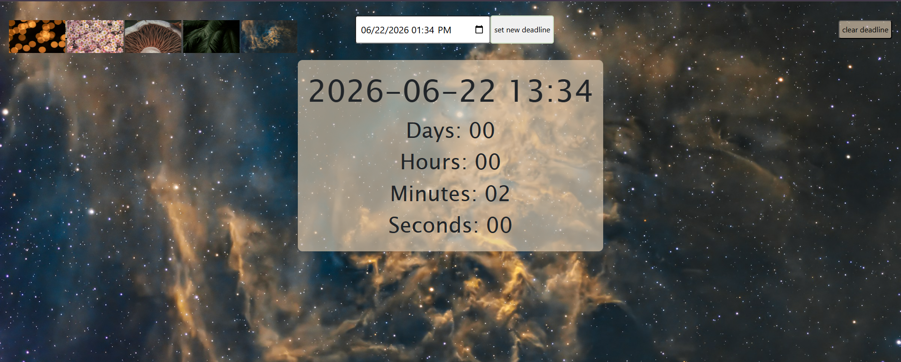
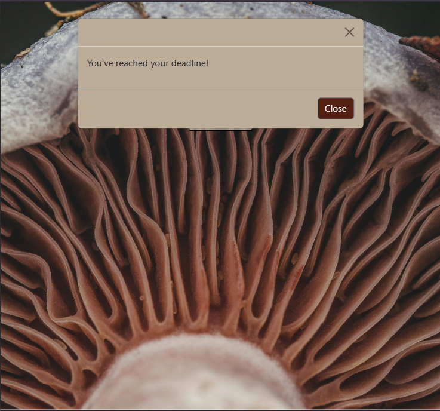

##⏳ Deadline Timer

A web-based countdown timer application that helps users track important deadlines and events.
The application is fully responsive and optimized for desktop, tablet, and mobile devices.

##🚀 Live Demo
[](https://irenefox2025.github.io/deadline-timer/)

##✨ Features

- Set custom deadlines with date and time
- Real-time countdown display
- Sound notification when a deadline is reached
- Modal deadline alert
- Customizable background gallery
- Automatic data saving with Local Storage
- Responsive design for desktop, tablet, and mobile devices
- Persistent user settings between sessions

##🛠 Technologies
- HTML5
- CSS3
- JavaScript (ES6+)
- Bootstrap
- Local Storage API

##📸 Screenshots

# Main Screen



# Background Gallery



# Deadline Notification



##📂 Project Structure
```
DeadlineTimer/
│
├── index.html
├── README.md
│
├── css/
│   ├── style.css
│   └── media.css
│
├── script/
│   └── index.js
│
├── img/
│   └── background images
│
├── audio/
│   └── new-notification.mp3
│
└── assets/
    ├── main-screen.png
    ├── background-gallery.png
    └── deadline-modal.png
```
    
##👩‍💻 Author

Created by Irina Bronnikova
📧 bronnikova702@gmail.com
GitHub: https://github.com/IreneFox2025
